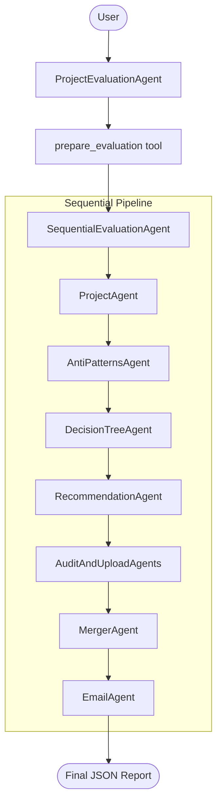

# Decision Tree Agent

An AI Agent Architectural Suitability Evaluator built with the [ADK TypeScript SDK](https://github.com/google/adk). This multi-agent system evaluates project descriptions to determine their suitability for AI agent architectures, identifies anti-patterns, applies decision-tree logic, and generates comprehensive architectural recommendations.

## Prerequisites

- **Node.js 24 or higher** (Required by ADK TypeScript SDK)
- **npm** (comes with Node.js)
- **Docker and Docker Compose** (for MailHog testing)
- A Google Cloud Project (for Vertex AI) or a Gemini API Key.

## Installation

1. **Clone the repository:**

   ```bash
   git clone <repository-url>
   cd decision-tree-agent
   ```

2. **Install dependencies:**

   ```bash
   npm install
   ```

3. **Configure environment variables:**

   Copy the example environment file and fill in your credentials:

   ```bash
   cp .env.example .env
   ```

   Edit `.env` and provide your configuration:
   - `GEMINI_MODEL_NAME`: The model to use (e.g., `gemini-3-flash-preview`).
   - Provide `GOOGLE_CLOUD_PROJECT`, `GOOGLE_CLOUD_LOCATION`, and set `GOOGLE_GENAI_USE_VERTEXAI=TRUE`.
   - Ensure the Default compute service account of the project has Vertex AI User role.

## Running the Agent

The agent can be executed in two modes using the ADK DevTools.

### 1. Web Mode (Recommended)

This mode provides a local web UI to interact with the agent, visualize state, and debug the multi-agent workflow.

```bash
npm run web
```

Once started, the UI is typically accessible at `http://127.0.0.1:8000`.

### 2. CLI Mode

Run the agent directly in your terminal for a text-based interaction.

```bash
npm run cli
```

## Testing with MailHog

MailHog provides a local SMTP server and web interface to capture and view test emails without sending them to real addresses.

1. **Launch Docker Desktop** (or ensure the Docker daemon is running).

2. **Start MailHog:**

   ```bash
   docker compose up -d
   ```

3. **Access the Web UI:**

   Open `http://localhost:8025` in your browser to view captured emails.

4. **SMTP Configuration:**

   Ensure your application is configured to connect to MailHog. Copy the following SMTP settings from `.env.example` to your `.env` file (these are the defaults for MailHog):

   ```env
   # SMTP Settings (MailHog)
   SMTP_HOST="localhost"
   SMTP_PORT=1025
   SMTP_USER=""
   SMTP_PASS=""
   SMTP_FROM="no-reply@test.local"
   ADMIN_EMAIL="admin@test.local"
   ```

## Agent Architecture

This project uses a modular multi-agent architecture:



- **Root Orchestrator (`ProjectEvaluationAgent`)**: Manages the user interaction lifecycle and validates initial project descriptions.
- **Sequential Pipeline (`SequentialEvaluationAgent`)**: A series of specialized sub-agents that process the evaluation in order:
  - **ProjectAgent**: Breaks down the project components.
  - **AntiPatternsAgent**: Identifies potential architectural pitfalls.
  - **DecisionTreeAgent**: Applies core logic to determine agent suitability.
  - **RecommendationAgent**: Generates the final architectural strategy.
  - **AuditAndUploadAgents**: Handles logging and persistence.
  - **MergerAgent**: Consolidates all outputs into a final JSON report.
  - **EmailAgent**: Sends the finalized JSON report to the administrator via a configured SMTP server.

## Available Scripts

- `npm run build`: Compiles the TypeScript code to JavaScript in the `dist/` directory.
- `npm run cli`: Builds and executes the agent in CLI mode.
- `npm run web`: Builds and executes the agent in Web mode via ADK DevTools.
- `npm run lint`: Checks for code style and potential errors.
- `npm run format`: Automatically formats the codebase using Prettier.

## License

ISC
